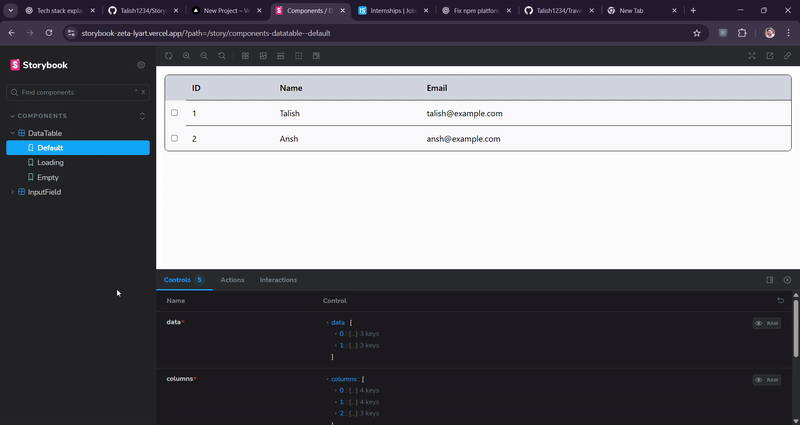

# React Component Library

This project contains reusable UI components built with **React**, **TypeScript**, and **TailwindCSS**.  
Components include an **InputField** with validation states and a **DataTable** with sorting and selection.

---

## 📂 Folder Structure
src/
│── components/
│ │── InputField/
│ │ ├── InputField.tsx # Input field component
│ │ ├── InputField.stories.tsx # Storybook stories for InputField
│ │
│ │── DataTable/
│ │ ├── DataTable.tsx # Data table component
│ │ ├── DataTable.stories.tsx # Storybook stories for DataTable
│
│── App.tsx # Main app component
│── main.tsx # React entry point
│── index.css # Global styles

---

## ⚡ Setup Instructions

1. **Clone the repository**
   ```bash
   git clone https://github.com/Talish1234/Input_and_datatable.git
   cd Input_and_datatable
   ```
   
2. **Install dependencies**
   ```bash
   npm install
   ```
   
3. **Run the development server**
   ```bash
   npm run storybook
   ```
## Demo 


## 🛠 Components
**✅ InputField**

Features:

Text input with label, placeholder, helperText, errorMessage

- States: disabled, invalid, loading
- Variants: filled, outlined, ghost
- Sizes: sm, md, lg
- Optional: clear button, password toggle
- Optional: support for light & dark theme

**Usage:**
```bash
import { InputField } from './Components/InputField';

export default function App() {
  return (
    <InputField
      label="Username"
      placeholder="Enter your username"
      helperText="Must be at least 6 characters"
      errorMessage="Invalid username"
      variant="outlined"
      size="md"
    />
  );
}

```
---
**🔹 DataTable**

A reusable table component with:

Sorting by column

- Row selection (single/multiple)
- Loading & empty states
- Fully typed with generics
  
**Usage:**
```bash
import { DataTable } from './Components/DataTable';

const columns = [
  { key: 'name', title: 'Name', dataIndex: 'name', sortable: true },
  { key: 'email', title: 'Email', dataIndex: 'email' },
];

const data = [
  { name: 'John Doe', email: 'john@example.com' },
  { name: 'Jane Smith', email: 'jane@example.com' },
];

export default function App() {
  return (
    <DataTable
      data={data}
      columns={columns}
      selectable
      onRowSelect={(rows) => console.log(rows)}
    />
  );
}

```
---

## 🧠 Approach

- **Component-driven design**: Each feature (Input, DataTable) is built as an isolated, reusable component.
- **Type safety with generics**: The DataTable is generic (<T>) so it works with any data shape.
- **TailwindCSS utilities**: Used for responsive, consistent styling with dark mode support.
- **Priority handling**: In InputField, icons (loading > clear > password toggle) follow a priority order to avoid overlap.
- **Stateful enhancements**: Row selection, sorting, and controlled input values are managed via React hooks (useState, useMemo).

## 🌙 Dark Mode

Tailwind’s dark: classes are used. To enable dark mode, add dark-theme="dark" on parent element.
